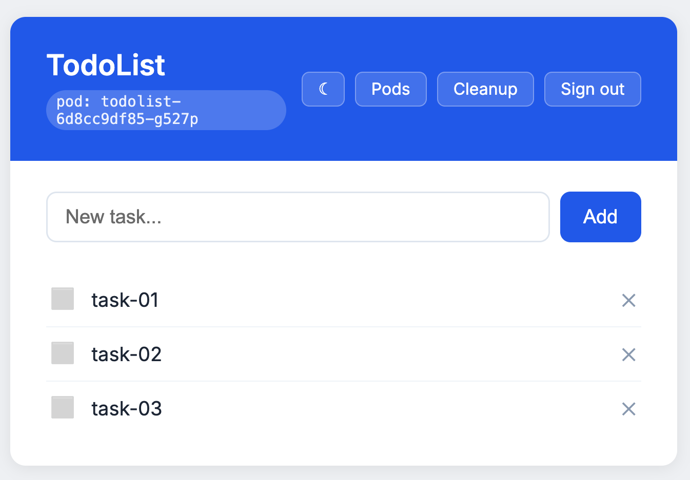

# TodoList

Aplicação web de lista de tarefas.



## Stack

- Python 3.11
- Flask
- SQLAlchemy
- PostgreSQL
- gunicorn

## Variáveis de ambiente

### Aplicação

| Variável | Padrão | Descrição |
|---|---|---|
| `APP_NAME` | `TodoList` | Título exibido na interface |
| `APP_PORT` | `5000` | Porta do servidor |
| `APP_COLOR` | *(cinza)* | Cor do tema da interface. Valores aceitos abaixo |
| `SESSION_KEY` | `dev-only-insecure-key` | Assina os cookies de sessão via HMAC |
| `ADMIN_USER` | `admin` | Usuário de login |
| `ADMIN_PASSWORD` | `admin` | Senha de login |
| `CLEANUP_TOKEN` | *(vazio)* | Token exigido no header `X-Cleanup-Token` pelo endpoint `POST /cleanup` |

### Banco de dados

| Variável | Padrão | Descrição |
|---|---|---|
| `DB_HOST` | `localhost` | Host do PostgreSQL |
| `DB_PORT` | `5432` | Porta do PostgreSQL |
| `DB_NAME` | `todolist` | Nome do banco |
| `DB_USER` | `todolist` | Usuário do banco |
| `DB_PASSWORD` | *(vazio)* | Senha do usuário do banco |

O schema é criado pela própria aplicação na inicialização. O banco precisa existir e estar
acessível antes de a aplicação subir.

## Credenciais em arquivo

As credenciais podem vir de arquivo, em vez de variável de ambiente. A aplicação procura por
um arquivo com o nome da variável dentro de `SECRETS_DIR`, e usa a variável de ambiente apenas
quando o arquivo não existe.

| Variável | Padrão | Descrição |
|---|---|---|
| `SECRETS_DIR` | `/var/run/secrets/todolist` | Diretório onde a aplicação procura as credenciais em arquivo |

Valores que aceitam arquivo: `DB_USER`, `DB_PASSWORD`, `SESSION_KEY`, `ADMIN_USER`,
`ADMIN_PASSWORD` e `CLEANUP_TOKEN`.

Exemplo: com `SECRETS_DIR` no padrão, um arquivo em
`/var/run/secrets/todolist/DB_PASSWORD` é lido no lugar da variável `DB_PASSWORD`. Espaços e
quebras de linha nas pontas do arquivo são descartados.

## Valores aceitos em `APP_COLOR`

`purple`, `green`, `blue`, `cyan`, `pink`, `red`, `orange`, `brown`, `yellow`.

Valor ausente ou inválido resulta no tema cinza.

## Endpoints

| Endpoint | Método | Autenticação | Descrição |
|---|---|---|---|
| `/` | GET | Sessão | Lista de tarefas |
| `/login` | GET, POST | — | Formulário de login |
| `/logout` | GET | Sessão | Encerra a sessão |
| `/add` | POST | Sessão | Cria uma tarefa |
| `/toggle/<id>` | POST | Sessão | Alterna a tarefa entre feita e pendente |
| `/delete/<id>` | POST | Sessão | Remove uma tarefa |
| `/healthz` | GET | — | Verifica a conexão com o banco e responde `ok` |
| `/cleanup` | POST | Header `X-Cleanup-Token` | Remove todas as tarefas concluídas e responde com a quantidade removida |
| `/pods` | GET | Sessão | Lista os pods do namespace |
| `/cleanup/status` | GET, POST | Sessão | Histórico das execuções de limpeza. O POST suspende ou retoma o agendamento |

## Limpeza das tarefas concluídas

A aplicação não remove tarefas concluídas por conta própria. A limpeza precisa ser acionada de
fora, chamando o endpoint periodicamente com o token no header `X-Cleanup-Token`:

```bash
curl -X POST -H "X-Cleanup-Token: $CLEANUP_TOKEN" http://<host>/cleanup
```

A resposta é a quantidade de tarefas removidas, no formato `deleted N`. Sem o token correto o
endpoint responde `401`.

A página `/cleanup/status` mostra o resultado das últimas execuções e permite pausar e retomar
o agendamento.

## Executando localmente

Requisitos: Python 3.11 e um PostgreSQL acessível.

```bash
python3 -m venv .venv && source .venv/bin/activate
pip install -r requirements.txt

export DB_HOST=localhost
export DB_PORT=5432
export DB_NAME=todolist
export DB_USER=todolist
export DB_PASSWORD=sua-senha

export SESSION_KEY=chave-local
export ADMIN_USER=admin
export ADMIN_PASSWORD=admin
export CLEANUP_TOKEN=token-local

gunicorn --bind 0.0.0.0:5000 app:app
```

A aplicação fica disponível em `http://localhost:5000`.

## Observações

A aplicação foi escrita para rodar em Kubernetes. Fora de um cluster, parte das
funcionalidades não funciona por completo.

## Plataforma Kubernetes

Este repositório inclui uma plataforma local de demonstração baseada em kind, Terraform, Cilium,
Argo CD, CloudNativePG, Kyverno e Prometheus/Grafana. Ela é declarativa e reproduzível em macOS,
Linux e Windows via WSL2, desde que Docker esteja disponível.

O ambiente valida automação, GitOps, segurança de imagens e resiliência de componentes. Ele não
fornece tolerância à perda do host, do Docker Desktop ou do disco local.

### Pré-requisitos

- Docker Desktop com 4 CPUs, 6 GiB de memória e 20 GiB de disco disponíveis
- 25 GiB livres no host
- `git`, `make`, `terraform`, `kind`, `kubectl` e `helm`
- URL HTTPS deste repositório configurada em `TF_VAR_git_repository_url`

### Bootstrap

```bash
export TF_VAR_git_repository_url=https://github.com/<org>/<repo>.git
make bootstrap
```

O comando cria um cluster kind com um control-plane e três workers, instala a plataforma e cria a
aplicação Argo CD. A imagem da aplicação é promovida por digest a partir de uma pull request de
release aprovada; por isso o primeiro deploy requer uma imagem publicada no GHCR.

### Operação

| Serviço | Endereço |
|---|---|
| TodoList | `http://todolist.localhost` |
| Argo CD | `kubectl -n argocd port-forward svc/argocd-server 8080:80` |
| Grafana | `kubectl -n monitoring port-forward svc/grafana 3000:80` |

Execute `make test-ha` para validar rollout, recuperação de pod e perda de worker com tráfego
contínuo. Execute `make evidence` para coletar estado sanitizado do cluster em
`evidence/generated/`.

Consulte [a arquitetura](docs/architecture.md), os [ADRs](docs/adr/) e os
[runbooks](docs/runbooks.md) para decisões, limitações e procedimentos operacionais. Antes da
primeira promoção, aplique a [ruleset GitHub](docs/github-ruleset.md) que exige revisão humana em
`main`.
