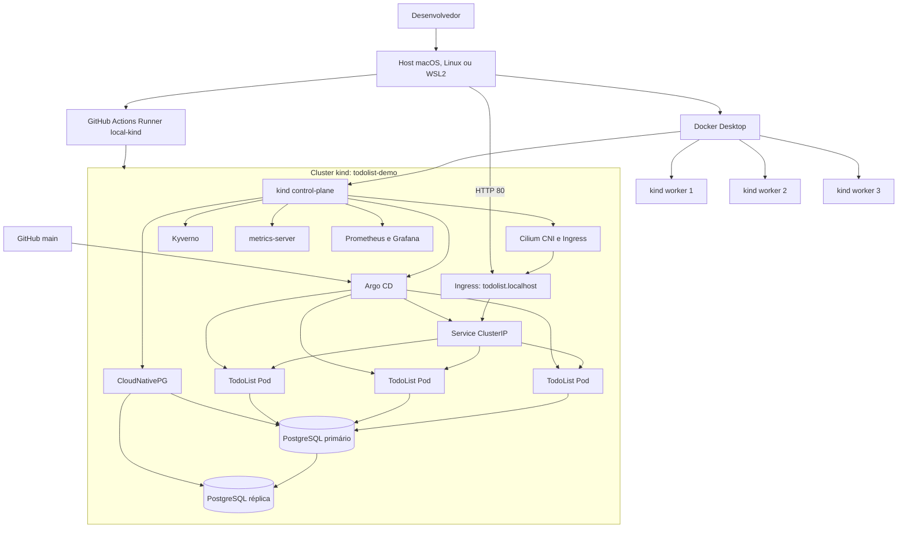
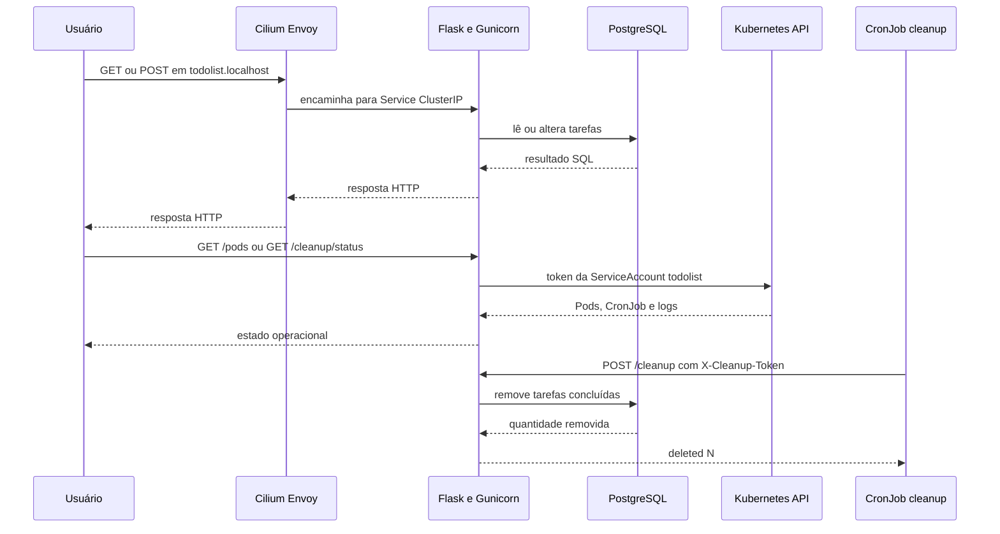
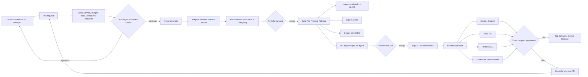

# Guia do Projeto TodoList

## Propósito

Este repositório entrega uma aplicação de lista de tarefas e uma plataforma Kubernetes local,
reproduzível e orientada a GitOps. O objetivo da demonstração é exercitar o ciclo completo de
uma mudança: validação, revisão humana, construção de imagem imutável, promoção por digest,
implantação, testes de resiliência e criação da release somente após a validação local.

O ambiente é adequado para desenvolvimento, demonstração e aprendizado. Ele não substitui uma
plataforma de produção: o cluster e seus volumes dependem do host e do Docker Desktop.

## Visão Geral

| Área | Implementação | Responsabilidade |
|---|---|---|
| Aplicação | Python 3.11, Flask, Gunicorn e SQLAlchemy | Interface web, tarefas, limpeza e consulta operacional |
| Banco | PostgreSQL operado por CloudNativePG | Persistência e réplica local |
| Empacotamento | Helm chart em `charts/todolist` | Workload, Service, Ingress, RBAC e políticas de rede |
| Infraestrutura | Terraform, kind e Helm | Cluster e operadores de plataforma |
| Entrega | GitHub Actions, Argo CD, GHCR e Cosign | Validação, imagem assinada, GitOps e release |
| Observabilidade | Prometheus, Grafana e evidências de workflow | Métricas, inspeção e artefatos de teste |

## Infraestrutura

O comando `make bootstrap` cria o cluster `todolist-demo` com um control-plane e três workers.
O control-plane publica as portas 80 e 443 do host para o Ingress Cilium. Terraform instala os
operadores e cria a `Application` do Argo CD, que acompanha `main` e o arquivo
`charts/todolist/values-demo.yaml`.



### Componentes de plataforma

- **kind:** fornece o Kubernetes local. O CNI padrão é desabilitado para que o Cilium seja
  instalado pelo Terraform.
- **Cilium:** implementa rede, Ingress, políticas de rede e as entidades `ingress` e
  `kube-apiserver` usadas pelas políticas da aplicação.
- **Argo CD:** reconcilia automaticamente o chart Helm de `main`, com `prune` e `selfHeal`.
- **CloudNativePG:** mantém o cluster `todolist-db` com primário e réplica.
- **Kyverno:** valida baseline de segurança e a procedência da imagem.
- **Prometheus e Grafana:** disponibilizam observabilidade de demonstração; a retenção do
  Prometheus é limitada a duas horas para caber no host local.

### Limites

- Perda do host, Docker Desktop ou disco local interrompe o ambiente.
- Os volumes do kind não são uma estratégia de disaster recovery.
- O RTO esperado para failover do banco é de até 90 segundos.
- Os recursos assumem Docker Desktop com 4 CPUs, 6 GiB de RAM e 20 GiB de disco; 25 GiB livres
  no host são recomendados.

## Aplicação

A TodoList executa Flask atrás de Gunicorn na porta 5000. SQLAlchemy usa explicitamente o driver
`psycopg2`, que está presente na imagem. Os segredos são montados em
`/var/run/secrets/todolist`; a aplicação prefere arquivos nesse diretório a variáveis de ambiente.



### Funcionalidades e endpoints

| Recurso | Endpoint | Controle |
|---|---|---|
| Tarefas | `/`, `/add`, `/toggle/<id>`, `/delete/<id>` | Sessão autenticada |
| Saúde | `/healthz` | Sem autenticação; verifica acesso ao banco |
| Limpeza | `POST /cleanup` | Header `X-Cleanup-Token` |
| Pods | `GET /pods` | Sessão e ServiceAccount `todolist` |
| Histórico de limpeza | `GET, POST /cleanup/status` | Sessão, acesso a Pods/logs e CronJobs |

### Identidade e rede

O Deployment usa a ServiceAccount `todolist`. Seu Role é limitado ao namespace e permite
`get`/`list` de Pods, `get` de `pods/log` e `get`/`list`/`patch` de CronJobs. A ServiceAccount não
lista Secrets.

As políticas são complementares:

- A `NetworkPolicy` da aplicação limita ingresso, DNS, banco e tráfego HTTPS necessário.
- A `CiliumNetworkPolicy` permite a identidade `ingress` em TCP 5000 e o acesso à entidade
  `kube-apiserver` em TCP 6443 para as telas operacionais.
- O CronJob de limpeza tem label próprio e uma política de egress que permite somente o acesso
  aos Pods TodoList em TCP 5000.

## Processo Git, CI e CD

`main` é protegida por ruleset. Toda alteração entra por pull request, requer aprovação humana e
o check `Verify / verify`. Nenhum workflow faz merge em `main`.



### Workflows

| Workflow | Gatilho | Executor | Resultado |
|---|---|---|---|
| `Verify` | Pull request | GitHub-hosted | Compilação Python, imagem, Helm, kubeconform e Terraform |
| `Prepare Release` | Push em `main` | GitHub-hosted | PR de versão por Conventional Commits |
| `Build And Propose Release` | Alteração de `VERSION` ou manual | GitHub-hosted | Imagem multiarch, SBOM, assinatura e PR de digest |
| `Deploy And Verify Local Platform` | Alteração no digest promovido | Runner `local-kind` | Sync, smoke, HA, RBAC, evidência, tag e release |

O runner local é um GitHub Actions Runner exclusivo do repositório, com labels `self-hosted`,
`macos` e `local-kind`. Ele reside em `~/.local/share/todolist-actions-runner` para evitar espaços
no caminho dos scripts temporários do Actions Runner.

## Processo de implantação

1. Configure `TF_VAR_git_repository_url` com a URL HTTPS do repositório.
2. Execute `make bootstrap` para criar o kind, operadores, banco e `Application` Argo CD.
3. Execute `./scripts/setup-automation.sh` para configurar o secret de release e o runner local.
4. Promova uma imagem pelo fluxo de pull requests; não altere o digest nem recursos diretamente
   no cluster.
5. Argo CD detecta o merge em `main` e aplica o chart.
6. O workflow local valida a implantação e só então cria a tag e a release.

Comandos úteis:

```bash
kubectl get application/todolist -n argocd
kubectl get pods -n todolist -o wide
curl --fail http://todolist.localhost/healthz
make test-ha
make evidence
```

## Evolução e correções realizadas

| Situação observada | Correção incorporada | Resultado esperado |
|---|---|---|
| Pod agendado no control-plane ou rollout bloqueado | Affinity para workers, políticas de spread e rollout com surge | Réplicas distribuídas sem usar control-plane |
| Imagem falhava com `ModuleNotFoundError: psycopg` | URI explícita `postgresql+psycopg2` | Inicialização com o driver empacotado |
| Wizard não baixava o runner ARM64 | Seleção do asset versionado do Actions Runner | Registro do runner em macOS ARM64 |
| Steps `run:` falhavam por espaço no diretório do runner | Migração para `~/.local/share/todolist-actions-runner` | Execução de shell no self-hosted runner |
| Ingress retornava timeout/503 | Regra Cilium para a entidade `ingress` | Acesso externo a `todolist.localhost` |
| Telas Pods e Cleanup expiravam ao consultar a API | Egress Cilium para `kube-apiserver:6443` | Consultas à API Kubernetes pela aplicação |
| CronJob de cleanup não alcançava a aplicação | Políticas específicas de ingresso e egress do componente cleanup | Execução da limpeza e logs do Job |

## Segurança e operação

### Fluxo de credenciais

Nenhum segredo de aplicação, token de automação ou chave privada é versionado. O ambiente de
demonstração gera o `Secret` Kubernetes pelo Terraform e guarda o estado local fora do Git. O
wizard armazena o PAT de release em arquivo local com permissão `0600` e o envia ao GitHub como
Actions secret. No workflow de build, a assinatura Cosign usa identidade OIDC temporária, sem
chave privada persistente.

```mermaid
flowchart TB
  subgraph Local[Estação local]
    Operator[Operador] --> Wizard[scripts/setup-automation.sh]
    Wizard --> LocalToken[.local/release-please.env\nchmod 0600]
    Terraform[Terraform] --> State[terraform.tfstate\nignorado pelo Git]
  end

  subgraph GitHub[GitHub]
    Wizard -->|gh secret set| ActionsSecret[Actions secret\nRELEASE_PLEASE_TOKEN]
    ActionsSecret --> ReleasePlease[release-please]
    Build[Build And Propose Release] -->|OIDC temporário| Cosign[Cosign]
    Cosign --> Signature[Assinatura da imagem]
  end

  subgraph Cluster[Cluster kind]
    Terraform -->|aplica| K8sSecret[Secret todolist-secrets]
    K8sSecret -->|volume somente leitura| App[Pods TodoList]
    K8sSecret -->|CLEANUP_TOKEN| Cleanup[CronJob cleanup]
    App -->|lê arquivos| SecretDir[/var/run/secrets/todolist]
  end

  Git[Repositório Git] -. não armazena .-> LocalToken
  Git -. não armazena .-> State
  Git -. não armazena .-> K8sSecret

  subgraph Production[Produção recomendada]
    SecretManager[Secret manager corporativo] --> AppKey[Chave privada da GitHub App]
    AppKey --> GitHubApp[GitHub App]
    GitHubApp -->|token de instalação temporário| ReleaseAutomation[Automação de release]
    SecretManager --> SOPS[SOPS ou operador de segredos]
    SOPS --> K8sSecretProd[Secret Kubernetes]
  end
```

- Imagens são promovidas por digest e assinadas com Cosign/OIDC.
- Kyverno aplica baseline restrito e valida a procedência da imagem.
- Segredos são gerados pelo Terraform e montados como arquivos; não são versionados.
- `RELEASE_PLEASE_TOKEN` é um secret GitHub de demonstração. Produção deve usar GitHub App e
  secret manager corporativo.
- Evidências são armazenadas como artefatos do workflow por 30 dias.
- Em caso de falha, corrija por nova pull request e permita a reconciliação GitOps; não aplique
  correções manuais persistentes no cluster.

## Documentos relacionados

- [Arquitetura da plataforma](architecture.md)
- [CI/CD](ci-cd.md)
- [Gestão de releases](release-management.md)
- [Operação do runner](self-hosted-runner.md)
- [Runbooks](runbooks.md)
- [Segurança da automação](security-automation.md)
- [Ruleset do GitHub](github-ruleset.md)
- [Decisões arquiteturais](adr/)
